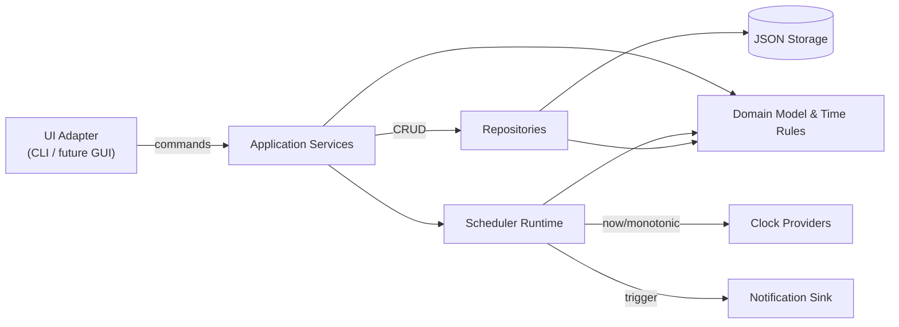

# Timer & Alarm Clock App — Architecture & Design (v0.1)

Date: 2026-02-23

This document proposes a Python architecture and software design that implements the requirements defined in [requirements.md](requirements.md).

Rendered diagram asset: [architecture_diagram.svg](architecture_diagram.svg)

---

## 1. Requirements Elicitation & Clarification

### 1.1 Functional requirements (extracted)
- **Alarms**: create/edit/delete/enable/disable alarms; trigger at time-of-day; recurrence: one-time/daily/weekdays; alert on trigger; handle multiple simultaneous triggers. (Req 5–10)
- **Reminders**: create/edit/delete/enable/disable reminders; schedule at specific date+time (with optional time zone); alert on trigger; mark fired; on restart mark missed reminders in past. (Req 12–16)
- **Countdown timer**: configurable duration; start/pause/resume/cancel; alert when complete; use monotonic clock. (Req 17–20)
- **Pomodoro timer**: configurable work/short/long breaks and cycles; start/pause/resume/stop; automatic phase transitions; alerts at phase end. (Req 21–24)
- **World clock**: add/remove time zones; display current date+time in each; DST-aware. (Req 25–27)
- **Date/time conversion**: convert between time zones; convert to UTC; optional epoch conversion; support 12/24h formatting. (Req 28–31)

### 1.2 Non-functional requirements (extracted)
- Local persistence and restore on startup. (Req 1–4)
- Correctness across time zones / DST and ambiguous/non-existent local times; define policy for time zone change behavior. (Req 32–34)
- Input validation and clear next-trigger display. (Req 35–36)
- Offline operation, local privacy, startup time target. (Req 37–39)

### 1.3 Clarifications needed / assumptions
The requirements include explicit open questions. For architecture v0.1, we assume (matching requirements doc assumptions):
- **Runs locally** and works offline. (Req 37)
- **Triggers only while app is running** (no OS-level background scheduling). This is important because it shapes the scheduler and notification approach.
- **Alarms are “time-of-day in local zone”**, reminders are “instant in configured zone”. (Req 34)
- UI form factor is not specified; architecture will support **CLI first** while enabling a future GUI.

---

## 2. Architecture Reasoning

### 2.1 Architectural style selection
**Decision criteria from requirements**
- Multiple features share time computation and persistence concerns → avoid duplication and keep time logic testable. (Req 1–4, 20, 33)
- UI not specified → isolate UI from core so we can add a GUI later without rewriting scheduling logic. (Ambiguity)
- Need deterministic behavior around DST/time zones → centralize conversions and validation. (Req 28–34)

**Options considered**
1. **Monolithic script with global state**
   - Pros: fastest to start.
   - Cons: time logic, scheduling, and persistence become entangled; hard to test; difficult to swap UI.
2. **Layered architecture (UI → services → data)**
   - Pros: familiar, simple.
   - Cons: still easy to leak infrastructure details into core unless carefully designed.
3. **Hexagonal (Ports & Adapters)**
   - Pros: isolates domain/application logic from persistence, clock, and notifications; supports multiple UIs.
   - Cons: slightly more upfront structure.

**Conclusion**
Use a **Hexagonal architecture** with:
- **Domain**: pure models and time computation rules.
- **Application**: orchestration services + scheduler loop.
- **Adapters/Infrastructure**: JSON persistence, system clock, notification output.
- **UI**: CLI (and later GUI) calling application services.

This directly supports testability (time logic), UI flexibility, and clean separation. (Req 1–4, 20, 33, 35)

### 2.2 Scheduling approach
**Constraints**
- Must trigger alarms/reminders while app runs. (Assumption)
- Timers must use monotonic time where possible. (Req 20, 33)

**Options**
1. Polling loop every second and checking all items
   - Simple but inefficient; can drift; harder to reason about missed triggers.
2. Priority queue (min-heap) of next events + sleep until next
   - Efficient; predictable; good for simultaneous events.

**Conclusion**
Use a **scheduler service** maintaining a min-heap of upcoming events. Recompute “next occurrence” for recurring alarms after firing. This supports simultaneous triggers and clean separation from UI. (Req 8–10, 14)

### 2.3 Time zone and DST correctness
**Requirements pressure**
- Detect ambiguous/non-existent local times and force user resolution or adjust. (Req 32)
- Use IANA time zones. (Req 4)

**Trade-off**
- Standard library `zoneinfo` is great for conversion, but detecting “non-existent” local times robustly is not ergonomic.

**Conclusion**
- Use `zoneinfo` as baseline (stdlib) for all conversions and world clock. (Req 4, 25–29)
- Add **optional dependency** `python-dateutil` to implement `datetime_exists()` / `datetime_ambiguous()` checks for inputs and for Req 32 behavior. If dependency is disallowed, implement a conservative fallback (reject times that fail roundtrip conversion) but accept that edge cases may be less friendly.

### 2.4 Persistence format
**Requirements pressure**
- Persist alarms/reminders/preferences locally; restore quickly. (Req 3, 39)

**Options**
- JSON file: simplest; human-readable; easy for a teaching repo.
- SQLite: stronger schema and concurrency; more overhead.

**Conclusion**
Start with a **single versioned JSON document** with atomic writes (write temp + rename). This meets NFRs and keeps implementation approachable. (Req 3, 38, 39)

---

## 3. Architecture Specification

### 3.1 Top-level components

1. **UI Adapter (CLI first)**
   - Responsibilities: parse user commands, render lists, start/stop timers, show alerts in terminal.
   - Requirement links: input validation UX (Req 35–36) and basic functionality exposure.

2. **Application Services**
   - Responsibilities: high-level use cases (create alarm, start countdown, etc.), call repositories and scheduler.
   - Requirement links: all feature requirements; isolates them from UI.

3. **Scheduler / Runtime**
   - Responsibilities: maintain upcoming events, sleep until next event, trigger notifications, update persisted state.
   - Requirement links: alarms/reminders firing (Req 9–10, 14–16), correctness (Req 33).

4. **Domain Model + Time Rules**
   - Responsibilities: entities (Alarm, Reminder, Timer), recurrence rules, “next trigger” calculations, conversion rules.
   - Requirement links: recurrence (Req 8), timezone policies (Req 34), DST handling (Req 32).

5. **Infrastructure Adapters**
   - **Persistence**: JSON store, schema versioning, repositories.
   - **Clocks**: wall-clock provider + monotonic provider.
   - **Notifications**: in-app alert sink (console for CLI; GUI notification later).
   - Requirement links: persistence and privacy (Req 3, 38), monotonic timing (Req 20, 33).

### 3.2 Architecture diagram (Mermaid)



### 3.3 Traceability notes
- **Scheduler + notification sink** are justified primarily by trigger requirements. (Req 9–10, 14–16)
- **Monotonic clock provider** is justified by countdown/pomodoro accuracy and clock-change resilience. (Req 20, 33)
- **Central time rules module** is justified by DST and timezone complexity. (Req 4, 32–34)

---

## 4. Software Design Reasoning

### 4.1 Domain modeling choices
**Goal**: Keep entities serializable, predictable, and UI-agnostic.

- Use `dataclasses` for domain entities.
- Store all persisted datetimes in an unambiguous representation:
  - For reminders: store as **UTC instant** plus original zone + user-facing fields.
  - For alarms: store as **local time-of-day + recurrence rule**, plus a “zone policy” (default: current local zone at fire time per Req 34).

This avoids repeated DST ambiguity and makes computations consistent.

### 4.2 Scheduler design
**Goal**: Efficient, correct scheduling without busy-wait.

- Maintain a `heapq` of `(next_fire_instant_utc, event_id, event_type)`.
- On startup:
  - Load persisted data.
  - Compute next occurrences and populate heap.
  - Apply “missed reminder” policy. (Req 16)
- Event loop:
  - Determine next instant; sleep until due.
  - When due, emit notification(s), update state (mark fired / compute next).
  - Persist after state change.

This supports simultaneous events by draining all due events in the same tick.

### 4.3 Countdown and pomodoro timebase
**Goal**: timers should not jump due to system time changes.

- Use `time.monotonic()` for countdown and pomodoro elapsed tracking. (Req 20, 33)
- Persist timer configuration and last-known state; on restart, treat running timers as stopped (unless a requirement later demands resume).

### 4.4 DST ambiguity handling (Req 32)
**Goal**: detect and handle ambiguous/non-existent local inputs.

- When user inputs a local date+time with a zone:
  - Validate zone exists.
  - Use dateutil helpers:
    - If non-existent: either (a) require user to adjust, or (b) auto-adjust forward to next valid time (configurable policy).
    - If ambiguous: require user to choose earlier/later offset (maps to `fold=0/1`).

This is implemented in a single input-normalization function used by reminders and conversions.

### 4.5 Error handling strategy
- Define domain-level exceptions: `ValidationError`, `NotFoundError`, `ScheduleError`.
- Application services convert these to UI-friendly messages.

### 4.6 Security & privacy considerations
- No network use; only local storage. (Req 37–38)
- Avoid arbitrary file paths for storage; store in a fixed app directory.
- Use atomic writes to prevent corrupt state on crash.

---

## 5. Software Design Specification

### 5.1 Proposed Python package/module layout

```text
04_timer_app/
  requirements.md
  architecture.md
  src/
    timer_app/
      __init__.py
      domain/
        models.py
        recurrence.py
        time_rules.py
      application/
        services.py
        scheduler.py
      ports/
        repositories.py
        clocks.py
        notifications.py
      infrastructure/
        json_store.py
        system_clocks.py
        console_notifications.py
      ui/
        cli.py
  data/
    timer_app.json
```

This layout is designed to keep domain and application code independent of UI and infrastructure.

### 5.2 Domain entities (illustrative)

```python
from dataclasses import dataclass
from datetime import time, datetime
from typing import Literal, Optional

Recurrence = Literal["once", "daily", "weekdays"]

@dataclass(frozen=True)
class Alarm:
    id: str
    label: str
    enabled: bool
    time_of_day: time
    recurrence: Recurrence

@dataclass(frozen=True)
class Reminder:
    id: str
    message: str
    enabled: bool
    scheduled_utc: datetime  # timezone-aware UTC
    source_tz: str           # IANA id for display/traceability
    status: Literal["scheduled", "fired", "missed"]
```

**How this satisfies requirements**
- Stable IDs: (Req 1)
- Enabled/disabled + scheduled/fired: (Req 2)
- Time zone stored as IANA id: (Req 4)

### 5.3 Ports (interfaces)

```python
from typing import Protocol, Iterable
from datetime import datetime

class AlarmRepository(Protocol):
    def list(self) -> Iterable[Alarm]: ...
    def get(self, alarm_id: str) -> Alarm: ...
    def upsert(self, alarm: Alarm) -> None: ...
    def delete(self, alarm_id: str) -> None: ...

class ReminderRepository(Protocol):
    ...

class WallClock(Protocol):
    def now_utc(self) -> datetime: ...

class MonotonicClock(Protocol):
    def now(self) -> float: ...

class NotificationSink(Protocol):
    def notify(self, title: str, message: str) -> None: ...
```

### 5.4 Application services (use cases)

```python
class AlarmService:
    def create_alarm(...): ...  # Req 5
    def update_alarm(...): ...  # Req 6
    def enable_alarm(...): ...  # Req 7
    def disable_alarm(...): ...

class ReminderService:
    def create_reminder(...): ...  # Req 12
    ...

class ConversionService:
    def convert_timezone(...): ...  # Req 28
    def to_utc(...): ...            # Req 29
```

Services validate inputs (Req 35), call domain normalization (Req 32), and persist changes (Req 3).

### 5.5 Scheduler runtime (core loop)

Pseudocode (illustrative):

```python
heap = build_initial_heap(alarms, reminders)

while running:
    due = heap.peek_time()
    sleep_until(due)

    for event in pop_all_due_events(heap):
        if event.type == "reminder":
            fire_reminder(event)
        elif event.type == "alarm":
            fire_alarm(event)

        persist_state()
        schedule_next_occurrence_if_needed(event)
```

**Mapped requirements**
- Alarm/reminder triggering + simultaneous events: (Req 9–10, 14)
- Reminder post-trigger behavior + missed policy: (Req 15–16)

### 5.6 Countdown & pomodoro state machine

- Countdown:
  - States: `idle`, `running`, `paused`, `completed`, `canceled`
  - Timebase: monotonic; remaining time computed from `start_monotonic` + accumulated paused durations.
  - Requirements: (Req 17–20, 33)

- Pomodoro:
  - Phases: `work`, `short_break`, `long_break`
  - Session counter to decide long break after N work sessions.
  - Requirements: (Req 21–24)

---

## 6. Assumptions, Open Questions, and Next Steps

### 6.1 Assumptions (carried forward)
- App triggers alarms/reminders only while running.
- CLI is the first UI; GUI can be added later via adapters.
- JSON persistence is sufficient for v0.1.

### 6.2 Open questions (impacting architecture)
1. Must alarms/reminders fire when the app is closed? If yes, we need OS integration (macOS launch agents / notifications) and a different runtime model.
2. Do reminders require recurrence rules? That affects the recurrence engine and storage schema.
3. Is snooze required? If yes, define snooze policy and persistence.
4. Should timers resume after restart? If yes, persist monotonic offsets carefully and define behavior if the machine slept.

### 6.3 Next steps (implementation-oriented)
1. Confirm UI choice (CLI vs Tkinter) and notification behavior.
2. Create a minimal `src/timer_app` scaffold following the module layout.
3. Implement `time_rules.py` (timezone normalization + DST checks) first; it is the highest-risk correctness area.
4. Implement JSON storage with schema versioning + atomic write.
5. Implement scheduler heap loop and add basic CLI commands for CRUD + run loop.
